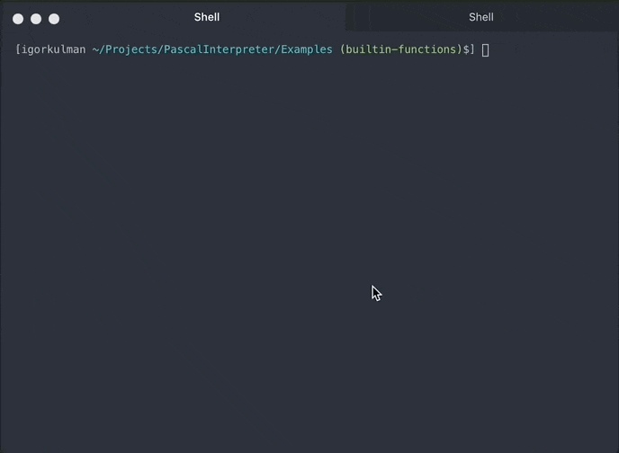
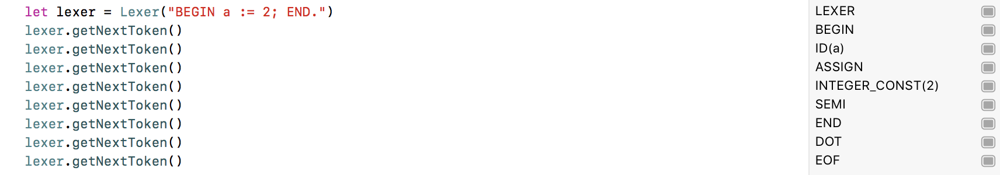
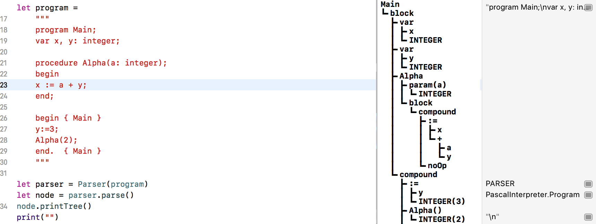
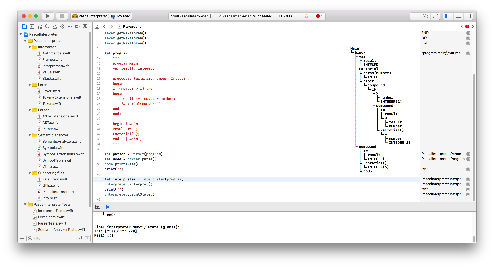

# Pascal interpreter written in Swift
[](https://opensource.org/licenses/MIT)
[](https://developer.apple.com/swift)
[](http://twitter.com/igorkulman)

Simple Swift interpreter for the Pascal language inspired by the [Let’s Build A Simple Interpreter](https://ruslanspivak.com/lsbasi-part1/) article series.

 

## Scructure

### Lexer

The [Lexer](PascalInterpreter/PascalInterpreter/Lexer/Lexer.swift) reads the Pascal program as `String` (a sequence of characters) and converts it into a sequence of [Tokens](PascalInterpreter/PascalInterpreter/Lexer/Token.swift). You can see the result by trying it our in the Playground or on the [unit tests](PascalInterpreter/PascalInterpreterTests/LexerTests.swift).



### Parser

The [Parser](PascalInterpreter/PascalInterpreter/Parser/Parser.swift) reads the sequence of tokens produced by the Lexer and builds an [Abstract Syntax Tree representation](PascalInterpreter/PascalInterpreter/Parser/AST.swift)(AST for short) of the Pascal program according to the [grammar](grammar.md). 

You can see what the AST looks like in the [unit tests](PascalInterpreter/PascalInterpreterTests/ParserTests.swift) or in the Playground where you can also use the `printTree()` method on any AST to see its visual representation printed into the console.



### Semantic analyzer

The [Semantic analyzer](PascalInterpreter/PascalInterpreter/Semantic%20analyzer/SemanticAnalyzer.swift) does static semantic checks on the Pascal program AST. It currently checks if all the used variables are declared beforehand and if there are any duplicate declarations. The result of semantic analysis is a [Symbol table](PascalInterpreter/PascalInterpreter/Semantic%20analyzer/SymbolTable.swift) that holds all the symbols used by a Pascal program, currently built in types (Integer, Real) and declared variable names. 

Implemented checks

* Check if a variable was declared with a known type (Integer, Real)
* Check if a variable was declared before usage
* Check if variable is not declared more than once
* Check if a procedure was declared
* Check if a procedure is called with the correct number of parameters

### Interpreter

The [Interpreter](PascalInterpreter/PascalInterpreter/Interpreter/Interpreter.swift) reads the AST representing the Pascal program from Parser and interprets it by walking the AST recursively. It can handle basic Pascal programs with declarations and arithmetics on integers and reals. 

At the end of the Pascal program interpretation you can check the resulting memory state (see [unit tests](PascalInterpreter/PascalInterpreterTests/InterpreterTests.swift)) or print it in the Playground using `printState()`.

## Try it out

There is a Swift playground in the project where you can try out the lexer, parser and the interpreter. The Playground interprets then following Pascal program defining and calling a factorial function

```` Pascal
program Main;
var result: integer;

function Factorial(number: Integer): Integer;
begin
if (number > 1) then
    Factorial := number * Factorial(number-1)
else
    Factorial := 1
end;

begin
result := Factorial(6);
end.
````

 
